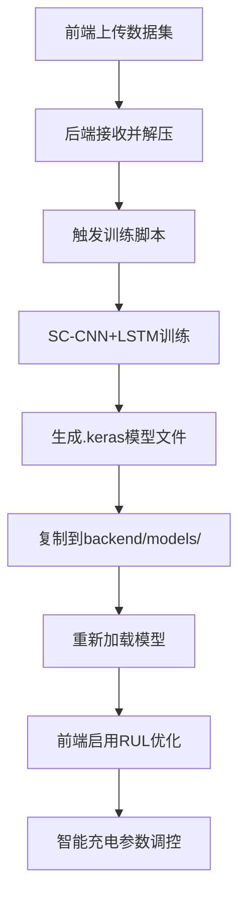

# RUL模型训练和激活指南

## 🎯 整体流程概览



## 📁 文件结构

### 训练生成的模型文件
```
C:\Projects\Battery_LSTM\models\
├── cnn_lstm_rul_model_k1.keras  # K折交叉验证模型1
├── cnn_lstm_rul_model_k2.keras  # K折交叉验证模型2
└── cnn_lstm_rul_model_k3.keras  # K折交叉验证模型3
```

### 后端模型存储
```
battery-charging-simulator/backend/models/
├── cnn_lstm_rul_model_k1.keras  # 激活的模型1
├── cnn_lstm_rul_model_k2.keras  # 激活的模型2
└── cnn_lstm_rul_model_k3.keras  # 激活的模型3
```

## 🚀 训练到激活流程

### 1. 训练数据上传
- **前端操作**: 在"RUL优化充电设置"区域上传数据集
- **数据格式**: ZIP文件，包含charge和discharge CSV文件
- **存储位置**: `RUL_prediction/data/uploads/{datasetId}/unzipped`

### 2. 训练任务触发
```javascript
// 前端触发训练
await api.triggerTrain({ datasetId: "test1" });
```

### 3. 后端训练处理
```python
# server.py: _run_training_job()
script = "SC-CNN+LSTM.py"
env["DATASET_DIR"] = str(candidate_dir)
proc = subprocess.Popen([py_exe, script], ...)
```

### 4. 模型文件生成
- **训练脚本**: `RUL_prediction/train/SC-CNN+LSTM.py`
- **输出位置**: `C:\Projects\Battery_LSTM\models/`
- **文件命名**: `cnn_lstm_rul_model_k{1,2,3}.keras`

### 5. 模型激活
```python
# server.py: _activate_latest_models()
def _activate_latest_models(max_k=3):
    # 复制训练好的模型到backend/models/
    for mpath in models:
        target = BACKEND_MODELS_DIR / f"cnn_lstm_rul_model_k{count+1}.keras"
        shutil.copy2(mpath, target)
    
    # 重新加载模型
    cnn_lstm_rul_model._load_or_create_model()
```

## 🧠 模型使用机制

### 1. 模型加载
```python
# models/cnn_lstm_rul_model.py
class CNNLSTM_RULModel:
    def _load_or_create_model(self):
        # 加载K折交叉验证的多个模型
        for i in range(1, 4):
            model_path = f"models/cnn_lstm_rul_model_k{i}.keras"
            if os.path.exists(model_path):
                self.models.append(load_model(model_path))
```

### 2. RUL预测
```python
def predict_rul(self, battery_history, static_features):
    # 使用多个模型进行集成预测
    predictions = []
    for model in self.models:
        pred = model.predict([cnn_input, lstm_input])
        predictions.append(pred)
    
    # 取平均值作为最终预测
    return np.mean(predictions)
```

### 3. 充电参数调整
```python
def adjust_charging_parameters(self, battery_state, rul_percentage):
    # 基于RUL百分比调整充电参数
    rul_factor = min(1.0, max(0.2, rul_percentage / 100))
    
    # 调整充电电流、电压、策略
    adjusted_params = {
        "cc_current": default_params["cc_current"] * combined_factor,
        "cv_voltage": default_params["cv_voltage"] * rul_factor,
        "max_soc": strategy["max_soc"],
        "charging_strategy": charging_strategy  # standard/eco/longevity
    }
    return adjusted_params
```

## 🎛️ 前端控制界面

### 1. 训练控制 (ChargingControls.vue)
- 数据集上传
- 训练触发
- 进度监控 (WebSocket + REST API轮询)

### 2. 模型管理 (ModelManager.vue)
- 模型状态显示
- RUL预测可视化
- 充电参数实时调控显示

### 3. 健康分析 (HealthAnalysisView.vue)
- 集成ModelManager组件
- 详细健康信息展示

## ⚙️ 充电参数调控机制

### 1. 实时调控触发
```python
# server.py: 电池状态更新时
if battery_model.is_charging and battery_model.rul_optimized_charging:
    adjusted_params = cnn_lstm_rul_model.adjust_charging_parameters(battery_state, rul_percentage)
    battery_model.update_charging_params(adjusted_params)
```

### 2. 参数调整策略

#### 基于RUL的调整
- **RUL > 70%**: 标准模式，正常充电参数
- **RUL 50-70%**: 经济模式，适度降低充电电流
- **RUL < 50%**: 延寿模式，显著降低充电电流，限制最大SOC

#### 基于温度的调整
- **温度 > 40°C**: 降低充电电流，加强散热
- **温度 < 5°C**: 低温充电保护

#### 基于SOC的调整
- **SOC > 80%**: 逐步降低充电电流
- **SOC > 90%**: 涓流充电模式

### 3. 充电策略
```python
strategy_factors = {
    "standard": {"cc": 1.0, "cv": 1.0, "max_soc": 100},  # 标准模式
    "eco": {"cc": 0.9, "cv": 0.98, "max_soc": 90},       # 经济模式  
    "longevity": {"cc": 0.7, "cv": 0.95, "max_soc": 80}  # 延寿模式
}
```

## 📊 前端显示效果

### 1. 模型状态
- ✅ 模型已激活 / ❌ 模型未激活
- 模型数量显示 (通常为3个K折模型)
- 最后训练时间

### 2. RUL预测
- 🎯 圆形进度条显示RUL百分比
- 📊 健康等级 (A/B+/B/C/D)
- 📅 预计剩余循环数和月数

### 3. 充电参数调控
- ⚡ 实时显示调整后的充电参数
- 📋 充电策略 (标准/经济/延寿)
- 💡 智能充电建议

## 🔧 故障排除

### 1. 模型未激活
- 检查训练是否成功完成
- 确认模型文件是否存在于`backend/models/`
- 重启后端服务器重新加载模型

### 2. RUL预测异常
- 检查电池历史数据是否充足
- 验证模型输入数据格式
- 查看后端日志中的错误信息

### 3. 充电参数未调整
- 确认RUL优化已启用
- 检查是否在充电状态
- 验证RUL预测值是否正常

## 🎉 使用示例

### 完整训练和激活流程
1. **上传数据**: 使用test_train_pipeline.py或前端界面
2. **监控训练**: 通过REST API轮询或WebSocket
3. **自动激活**: 训练完成后模型自动激活
4. **启用优化**: 在前端启用"RUL优化充电"
5. **开始充电**: 观察智能参数调控效果

### 验证模型效果
```bash
# 运行测试脚本
python test_train_pipeline.py --dataset-id test1 --dataset-path test_data

# 检查模型文件
ls battery-charging-simulator/backend/models/

# 启动前端查看效果
cd battery-charging-simulator/frontend && npm run dev
```

---

**🚀 恭喜！您已掌握了从RUL模型训练到智能充电参数调控的完整流程！**